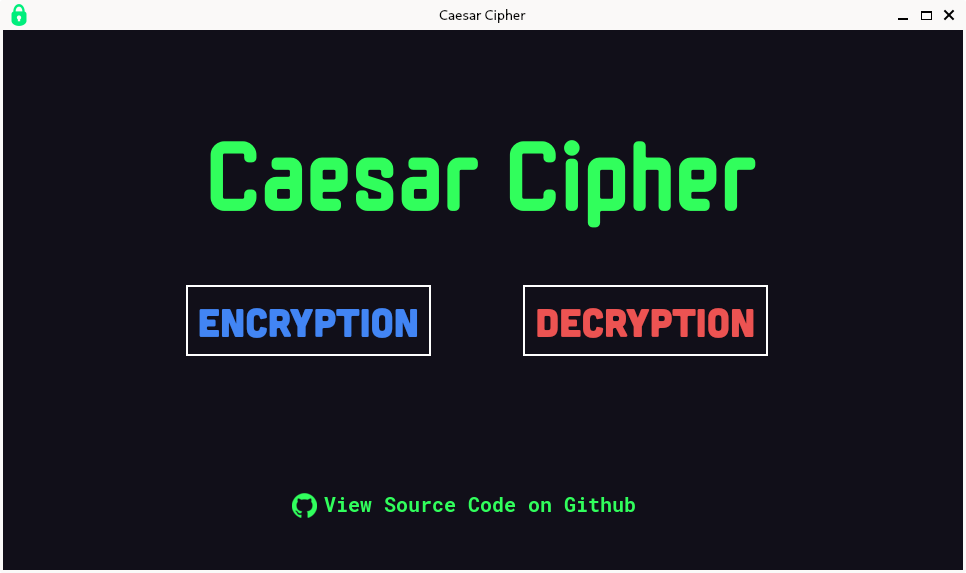

## About the Project

A crpytography program created based on the method of ancient romans called <strong>caesar cipher</strong>.
There are many cryptography programs available on the internet, however, this program is better than many.

Here's why:
<ul>
<li>The alogarithm used is easy to understand.</li>
<li>It is user-friendly and offers modern UI.</li>
<li>It is a fun program for many beginners who are not only interested in GUIs but also crpytography.</li>
</ul>

:warning: NOTE: <i><strong>Caesar cipher can be easily decrypted using a brute-force attack. Therefore, it is not recommended to use this for cryptography. Use at your own risk!</i>